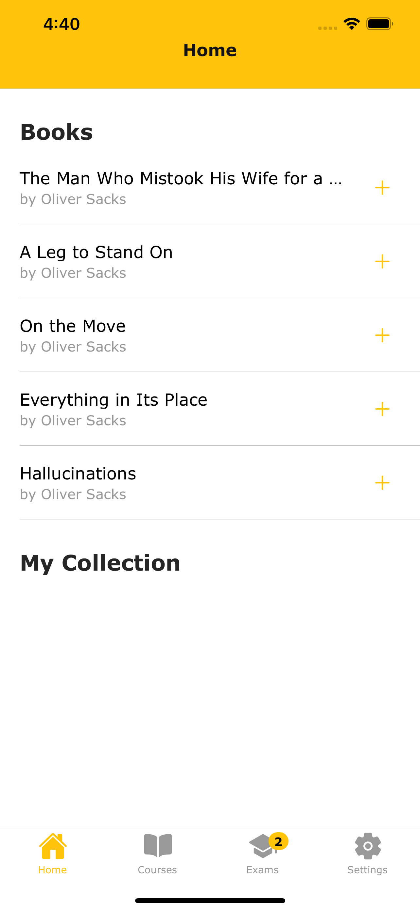

<h1>My Teacher</h1>
Developed Using Ionic Framework & Capacitor

  

### Key techincs used
  - Reactive Form
  - NgRx for state management
  - Native plugins
  - Single point for theming
  - Safe Area
  - Status bar color set up with primary color

### Screens
<table>
    <tr>
      <td>
           </img>
      </td>
      <td>
           </img>
      </td>
  </tr>
   <tr>
      <td>
           </img>
      </td>
      <td>
           </img>
      </td>
  </tr>
</table>

